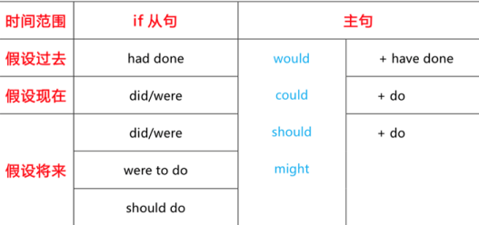

# 简单句
主语+谓语+宾语/表语

1. 有实义
（1）不及物动词vi. →主谓
（2）及物动词vt. →主谓宾
→主谓双宾
→主谓宾补
2. 无实义→（连）系动词→主系表

## 谓语动词变化
1. 时态
2. 情态
3. 语态
4. 否定

### 时态

| 时态     | 过去           | 现在            | 将来                          | 过去将来                      |
| -------- | -------------- | --------------- | ----------------------------- | ----------------------------- |
| 一般     | did            | do/dose         | will do am/is/are going to do | would do was/were going to do |
| 进行     | was/were doing | am/is/are doing | will be doing                 |                               |
| 完成     | had done       | have/has done   | will have done                |                               |
| 完成进行 |                |                 |                               |                               |

### 情态
| 现在时 | 过去时 |
| ------ | ------ |
| must   | 无     |
| can    | could  |
| will   | would  |
| shall  | should |
| may    | might  |

### 语态
被动：be+done

### 否定
1. 实义动词变否定
do/does/did＋not＋动词原形
2. 助动词和情态动词否定
助动词和情态动词＋not
（be动词、情态动词、完成时态中的have等）

### 强调
do/does/did+动词原形

## 主宾表变化
1. 名词/代词
2. doing
3. todo
4. 并列多个

## 简单句扩展
第一节词性角度的扩展
1. 限定词
2. 形容词、副词
3. 介词短语

第二节成分角度的扩展
1. 非谓语动词作定语、状语
2. 同位语、插入语

## 词类
1. 名词 Nouns
2. 冠词 Articles
3. 代词 Pronouns
4. 形容词 Adjectives
5. 数词 Numerals
6. 副词 Adverbs
7. 介词 Prepositions
8. 収词 Interjections
9. 连词 Conjunctions
10. 动词V erbs

# 长难句

## 并列句
| 表示顺接的并列连词                                     | 含义                             |
| ------------------------------------------------------ | -------------------------------- |
| "…and…""both…and…"                                     | “……和……”（两者都）               |
| "notonly…but…aswell","notonly…butalso…","notonly…but…" | “不但……而且……”（意思同“……和……”） |

| 表示转折的并列连词 | 含义       |
| ------------------ | ---------- |
| "…but…","…yet…"    | “……但是……” |

| 表示选择的并列连词 | 含义                 |
| ------------------ | -------------------- |
| "…or…""either…or…" | “……或者……”（二选一） |
| "neither…nor…"     | “既不……也不……”       |
（两个都不选）
（三）表示选择的并列连词
表示因果的并列连词|含义
"…for…"|“……因为……”
"…so…"|“……所以……”

## 名词性从句

### 主语从句
#### (一)位置
1. 居首（形式主语it）
It is done +  主语从句（表达人们对一件事的观点看法）
It is + adj./n. +  主语从句（表达对一件事的评价）
2. 句尾
#### (二)写法
连接词+陈述句
  
### 宾语从句
#### (一)位置
1. 动词后
及物动词+从句（动单宾）
及物动词+人+从句（动双宾）
非谓语动词＋从句
2. 介词后
3. 形容词后
4. 宾语从句后置，it 形式宾语
#### (二)写法
1. 陈述句变宾语从句
These figures are conservative.            
Dr. Worm acknowledges <u>(that) these figures are conservative</u>.
2. 特殊疑问句变宾语从句
Where did we put the keys just a moment ago?                                        
We suddenly can’t remember <u>where we put the keys just a moment ago</u>. 
3.  一般疑问句变宾语从句
Are other clients going to abandon me, too?                            
I don’t know <u>if other clients are going to abandon me, too…</u>

### 表语从句
#### (一)位置
系动词后（be动词最常用）
#### (二)写法
连接词+陈述句

### 同位语从句
#### (一)位置
抽象名词后

## 定语从句
### (一)位置
先行词(n.)后
### (二)写法
关系词+陈述句
| 先行词                                           | 关系词            |
| ------------------------------------------------ | ----------------- |
| 事/物                                            | which/that        |
| 人                                               | who / whom / that |
| 人／物（表示人或物的所有关系，“某人的／某物的”） | whose             |
| 时间                                             | when              |
| 地点                                             | where             |
| 原因                                             | why               |

| 对比     | 限定性定语从句                                      | 非限定性定语从句                                 |
| -------- | --------------------------------------------------- | ------------------------------------------------ |
| 逗号     | 无逗号                                              | 有逗号                                           |
| 先行词   | 范围不明确                                          | 范围明确                                         |
| 能否省略 | 不能省略                                            | 可以省略                                         |
| 翻译     | 向前翻译（“...的n.）                                | 不用往前翻译                                     |
| 关系词   | 可用that 作宾语可省略 指人作宾语，可用whom/who/that | 不可用that 作宾语不可省略 指人作宾语，只能用whom |

（一）限定性定语从句与同位语从句的区别
n.+从句
| 同位语从句                            | 限定性的定语从句                                                              |
| ------------------------------------- | ----------------------------------------------------------------------------- |
| 解释说明 n.                           | 修饰限定 n.                                                                   |
| 抽象 n.后                             | 任意 n.后（抽象或不抽象的 n.后都行）从句前若为不抽象的 n.，则可判断是定语从句 |
| n. + that 从句（that 不作从句的成分） | n. + that 从句（that 作从句的成分）                                           |
| 同位语从句中关系词都不能省略          | n.＋省略关系词的从句                                                          |

## 状语从句
### (一)位置
主句后
### (二)写法
从属连词+完整陈述句
#### 从属连词
1. 时间状语从句
when / while / as 
before / after    since / until 
as soon as    by the time 
each time / every time 
the next time 
2. 地点状语从句
where 
3. 原因状语从句
because 
since 
as 
now that 
4. 结果状语从句
so…  that…
such…  that…
so that…
5. 目的状语从句
so that… 
in order that… 
6. 条件状语从句
if 
once 
as long as / so long as 
7. 让步状语从句
although / though 
even if / even though 
while 
however 
8. 比较状语从句
than 
as 
9. 方式状语从句
as 
as if 

注意：as 
| 时间状语从句 | 当。。。的时候    |
| ------------ | ----------------- |
| 原因状语从句 | “因为”            |
| 比较状语从句 | 和。。。相比较    |
| 方式状语从句 | 按照……方式，如同” |
## 特殊句式
### 倒装
一、全部倒装
There be  句型：  There be + n. 
There be + n. +  介词短语
二、部分倒装
1. 否定副词或词组位于句首
2. only 位于句首
3. 虚拟条件句省略 if 
### 强调
### 虚拟
if 虚拟条件句

三、名词性从句的虚拟